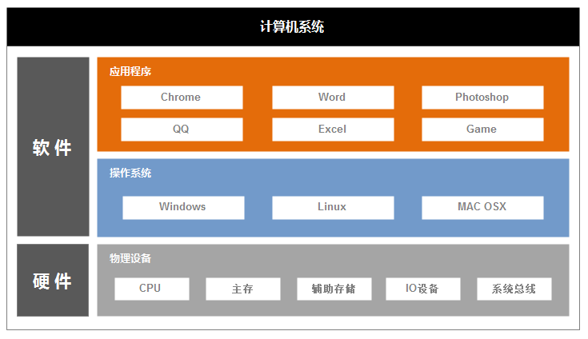
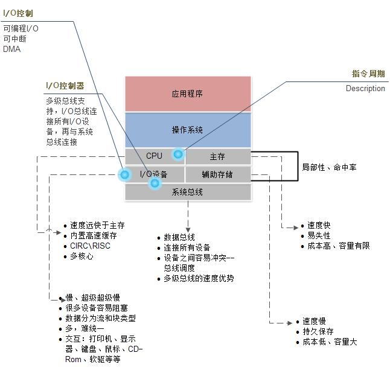

# 计算机基础知识
## Basic knowledge of Computer Science

 

### 计算机组成
计算机组成简单理解为三层：硬件即组成计算机的所有摸得见看得着的东西是计算机运行的基础；应用程序即完成特定功能、目的的用户程序是计算机的价值体现；中间就是操作系统，连接了硬件和应用程序负责硬件调度、资源管理和分配（内存、文件、CPU等等）、安全等一系列功能。

### 硬件
主要硬件包括CPU（算术、逻辑单元）、主存、辅助存储、系统总线、I/O设备（即输入输出）。

- **CPU**：CPU可以是单核、多核架构，主要目的进行运算。单核就是只有一个运算中心，多核具有多个运算核心，涉及缓存共享、寄存器数据的共享和进程调度问题；
- **总线**：连接所有设备，进行设备之间通讯的作用。总线上设备越多，冲突的几率就越大效率越差；
- **主存**：是存放指令和数据，与辅助存储器相比有容量小、读写速度快、价格高等特点，现在一般也通称为内存；
- **辅助存储**：也称为外储存器，是指除计算机内存及CPU缓存以外的储存器，断电后仍然能保存数据。常见的外存储器有硬盘、软盘、光盘、U盘等；
- **IO设备**：各种输入输出设备，比如显示器、键盘和鼠标等。

### 操作系统
常见的操作系统有微软公司的Windows、开源的Linux、苹果公司的OSX。它的主要作用是：

- 方便：提供方便的交互和资源管理
- 有效：分配资源，更有效的资源利用（内存管理、处理器调度、I/O调度等）
- 扩展能力：不中断服务增加系统特性的能力

### 进程
进程是程序执行的最小单位，包括：`用户程序`、`数据`、`栈`、`进程控制块`。

- 用户程序：要执行的程序。
- 数据：用户空间中可以被用户修改的部分。比如进程数据、可修改程序。
- Stack：每个进程都有一个或者多个栈用于保存参数、过程调用地址、系统调用地址。
- 进程控制块：操作系统控制进程需要的数据。包含了进程的属性，最基本的每个进程总要有个Id吧，还有进程状态、当前寄存器的值、程序计数器、Stack的指针等等。

### 线程
一个进程可以由多线程组成，其原因是因为进程创建、交换、销毁的开销太大。而线程远远小于进程的开销，可以由操作系统创建和进程调用库自己创建，于是有了两种不同类型的线程——`用户级别`和`内核级别`。

- 用户级别线程：进程调用线程库创建的，对操作系统是透明的；一旦一个线程引起了 `I/O阻塞` 就是进程阻塞，所以要阻塞整个进程；
- 内核级别线程：操作系统创建的，所以该阻塞线程的不会阻塞整个进程，效率没有用户级别的高；

### 多线程的应用场景
- 用户界面和后台数据运行：用户界面渲染和后台数据运算使用不同的线程，没有喜欢后台一运算界面就卡死的程序吧。
- 异步计算：不如实时备份，一个线程定时触发就可以了，没必要进程定时的检查是不是该备份了。
- 速度敏感的计算：可以并发计算的、多核处理的，在计算和组织上线程更具优势。
- 模块化：模块化的程序有时候很适合用多线程来设计。

### 并行程序设计
程序并行带来了效率的提升也带来复杂性的提升。就跟现实社会一样，竞争可能会引起`死锁`、`饥饿`。

- 死锁：多个进程各持有一个资源请求另外的资源，大家互不相让；
- 饥饿：竞争不过的进程一直得不到所请求的资源，结果耗着不动了。
    
### 经典并发问题

- 生产者/消费者：消费者不能消耗还没来得及生产的资源，生产者不能在容器满了以后继续往里面塞。
- 读者/写者问题：资源可以被多个进程读，但是同一时间只能有一个写者并且写者与读者互斥。
- 哲学家就餐问题：这个是一个死锁的问题，五个哲学家没用要用两个叉子吃饭，他们先拿起左手叉子，再拿起右手叉子，然后进餐，然后释放叉子。桌上一共五个作为五把叉子，如果哲学家同时坐下就会发生死锁。

### 文件管理

文件结构包括下面内容：

- 域（Field）：基本的数据单元，一个域包含一个值，如雇员名字、日期等。
- 记录（Record）：一组相关域的集合，可以看做应用程序的一个单元。
- 文件（File）：一组相关记录的集合，它被用户或应用程序看做一个实体，并可以通过名字访问。
- 数据库（DB）：一组相关数据的集合，它的本质特征是数据之间存在着明确的关系，可供不同的应用程序使用。
文件组织和访问 

### 速度匹配
CPU运算速度最快，其内置的一级高速缓存保持了和CPU同样的速度但是容量极小，接下来可能存在二级、三级高速缓存；主存（内存）其次和CPU存在数量级上的差距；辅助存储（多硬盘）的速度就不是一般的慢了，因为有机械运动，但是容量大很多；但是近年来随着SSD硬盘的出现，其速度逐渐能跟上内存的速度。

### 局部性原理
局限性本身分为时间局限性和空间局限性。时间局限性是说现在用到的指令很可能短时间内还会多次调用，空间局限性是现在调用的数据在辅寸上邻接的块很可能即将被用到。

### I/O设备
I/O设备一般较慢，极端点的比如键盘就非常慢。当程序需要读取I/O数据时就会被I/O设备阻塞，这是最差的情况整个系统空转直到I/O设备读取数据完成。

### 中断
中断是指令的运行是被暂时停止，需要读取的时候CPU发给I/O指令然后不理它了，需要读取的进程（或线程）进入阻塞状态换下一个进程来执行，当I/O准备好数据后发送一个中断信号给CPU，这时现在执行的进程被中断CPU会执行一段中断处理程序（通常很短）把之前阻塞的进程标记为Ready（可执行）状态，处理完中断后恢复之前中断的进程（或线程）继续执行。在当前进程执行完或者超时中断后（分时多道程序处理，超时也是一种中断），之前从阻塞中恢复的进程可能会被执行（取决于进程调度，不一定是下一个时间片里也可能是下几个时间片后或者干脆饿死了）。

### DMA
再后来又有了DMA（直接存储器访问），主要原因就是CPU很忙，你一个拷贝/传输整块数据的动作就不要每块数据都让我来处理了，系统中多了一个专门的辅助芯片干这个事情。CPU下达指令后辅助芯片负责设备之间的数据直接传输。DMA模块可以是总线中的一个模块也可以是I/O模块，但是仍然要占用总线（传输数据）所以并不是不会对系统性能产生影响，至少DMA冲突时CPU要等待一个总线周期。

### 操作系统启动过程
在计算机开机时，boot被自动执行，指引CPU把操作系统从大容量存储器中传送到主存储器的易失区[1]。一旦操作系统放到了主存储器中，boot要求CPU执行一条转移指令，转到这个存储区域，在这个时候，操作系统接管并且开始控制整个机器的活动。
在操作系统变成可用之前，boot可以执行BIOS，完成基本的输入输出活动。
1、开机执行BIOS（基本输入输出系统）引导程序，这个过程叫做系统自检，标识和配置所有的即插即用设备，并配置DMA通道；完成加电自检，测试内存，端口，键盘，视频适配器，磁盘驱动器等基本设备，以及CD-ROM驱动器；对引导驱动器可引导分区定位：在CMOS（complementary metal oxide semiconductor，互补金属氧化物半导体）中，可以自行设置引导顺序，一般顺序是软驱，磁盘，光驱；加载主引导记录以及引导驱动器的分区表，执行主引导记录MBR，主引导记录在硬盘上找到可引导分区，将其分区引导记录装入内存，并将控制权交给分区引导记录，由分区引导记录定位根目录，然后装入操作系统。

<iframe width="100%" height="520px" src="ani/Boot.mp4" frameborder="0" allowfullscreen></iframe>

### Unix传奇
时光追溯到上世纪六十年代，多数计算机都采用批处理命令。为了研发一个多用途，多用户的操作系统MULTICS，三个著名的公司开始联合进行研发。三个知名的公司是美国电话及电报公司（American Telephone and Telegraph Inc.；AT&T）、通用电器公司（General Electrics；G.E.）及麻省理工学院（Massachusetts Institute of Technology；MIT）。整个项目由于目标过于庞大，功能过于复杂，最终以失败告终。但是，隶属于贝尔实验室有个叫Ken Thompson的工程师，他负责为为MULTICS系统写个叫“Space Travel”的游戏。为了让这个游戏能继续下去，他不得不重新编写一个操作系统。当他去申请计算机的时候，显然领导不会因为一个游戏批准你一台计算机。早起的计算机并不像我们现在的pc机那么小巧。当时计算机可是巨无霸，每一台的造价也极其昂贵，只有企业和科研机构才能买得起。

数字设备公司（Digital Equipment Corporation；DEC）生产两种小型计算机 pdp系列和vax。 Ken无法得到pdp-11，却在一个角落了发现了pdp-7，虽然这个机器已经落后，Ken还是觉得如获至宝，随后他很顺利的用汇编完成了操作系统，并写完了游戏。有趣的是，Ken的一个同事Brian Kernighan非常不喜欢这个系统，嘲笑Ken Thompson说：“你写的系统好真烂，干脆叫Unics算了。”（unics在英文里表示单一，与mult相反）。Ken对Brian的评价到没有多大排斥，本身他的目标是游戏，而不是操作系统，也接受了同事的命名。然后他更乐于推广他的游戏，让同事们茶余饭后娱乐娱乐。那时是1969年8月，恰巧这一年，芬兰诞生了一个婴儿，Linus Torvalds啼哭的来到这个世界。

事情总是环环相扣，可是谁也不知道这环将会扣向哪一环。Ken的另一个同事Dennis Ritchie对Ken的游戏没有多大兴趣，倒是对Unics情有独钟。当时Ken用汇编完成的Unics，如果换到pdp-11上，Unics想要运行必须重新冲重新编写代码移植。Ken无法为当时不同的机型提供上百个Unics版本。这时，Dennis Ritchie在BCPL基础上，开发了一种新的高级语言将Unics重新写了一遍，并命名为 UNIX。这个语言是将BCPL语言进行了升级，也就是后来大名鼎鼎的C语言。尽管是游戏和嘲讽，Unix和C诞生了，并且完美地结合成为一个统一体，C与Unix很快成为世界的主导。新的历史，开始了。

当时的美国公司，工程师研发完毕，往往会有休假，一休就是一年。旅游，探险都是好方式，可是 Ken选择了到伯克利（Berkeley）进行教学。也难怪欧美的教育科技那么发达，总有黑客将知识和技术进行传承。由于当时AT&T被美国反垄断制裁，Bell实验室不能销售Unix。只能无偿提供大家学习研究。正是因为这样开放环境，使得Unxi的功能和特性被不断的丰富。在Berkeley，有一个专门研究UNIX小组，他们为UNIX提供了很多新特性，例如著名的 TCP/IP协议。并完成了BSD版本。很快，就有公司看到了BSD的商机，分分购买BSD进行商用。

这个时候，AT&T公司对其他机构拿着Unix赚钱自己却一无所获很不爽。那是一个AT&T妄图私有化的Unix的时代。为了私有化Unix，1986年IEEE指定了一个委员会制定了一个一个开放作业系统的标准,称为 POSIX (Portable Operating Systems Interface)。并和BSD进行法律官司，AT&T再次被反垄断，这场官司一直打到 AT&T再将自己的Unix系统实验室卖掉。当然，AT&T的Unix取得了这个标准制订战争的胜利，并取得了Unix注册商标。此时BSD的拥护者自喻为冷酷无情的公司帝国的反抗军。独立的Bell实验室就可以单独销售Unix，当时价格昂贵。也就在这个时候，人们被昂贵的Unix吓怕了，使用的人数骤减。与此同时，Berkeley BSD小组的Bill Joy开始创办了一家公司，也就是后来全球知名的SUN公司。就销售量来说，AT&T/UNIX始终赶不上BSD/Sun。并且Sun生产的小型工作站，风靡整个市场，很快就将 DEC 击败，并且让DEC退出了历史舞台。

BSD 仍然还在官司缠身，可是其他公司都看到了UNIX的商机，分分投靠 AT&T 并开发自己的Unxi，其中有著名的IBM的AIX，HP的HP-UX，SUN公司的Solaris，还有西雅图一个不知名的小公司，也生产着一个叫XENIX的Unix。时光继续走着，这个小公司的三个创始人打着扑克，心里还在构思。自己的公司如何挑战并取代那些巨无霸公司，成为是Microsoft未来的梦想。

### Windows 与 Mac OSX的恩恩怨怨
Unix的诞生，对与计算机的发展起到了至关重要的作用。人们可以通过操作系统去使用计算机。然而在当时，尽管DEC生产的小型机PDP系列和VAX系列比起早起的巨无霸已经算是比较苗条了，可是对于个人而言，计算机还是相当大的东西，并且造价昂贵，无法进行民用。

为了将大型计算机缩小体积，很多公司都在尝试。1975年，IBM推出了早起的PC兼容机。我们知道，操作系统与CPU是有直接关系，不同的cpu运行的操作系统是不一样的。当时Unix价格昂贵，IBM一台PC兼容机造价2w美元，操作系统都要花4w。这样还是无法民用，因此IBM选择了一家小公司Inter生产的X86系列的cpu。Inter是小公司？没错，当时确实是这样，小到不起眼。而主流生产cpu的却是摩托罗拉，摩托罗拉生产的M6800比Inter的技术和设计上都要先进很多，更重要的是这个可以运行Unix。IBM放弃了兼容机上的Unix，因而不得不自己写出了一个兼容X86的操作系统---PL/M。当然这个东东造价也不菲。

微软联合创始人Allen同学Tim Paterson原本是打算写个东西用来测试的16位Intel 8086 CPU界面，于是花四个星期写了一个操作系统。当Bill Gates得知之后，马上花5W美元买下了这个系统，Tim Paterson欣喜若狂，四个星期就赚了一大笔，简直像做梦，赶紧和Bill签订合同，Bill得到之后并命名为DOS。随后，Bill通过其IBM董事会成员的妈妈，得以和IBM高层谈判。IBM兼容机的操作系统价格昂贵，不适合卖个普通用户，IBM定义的主要对手是如火如荼的Apple，IBM想要压制apple就需要廉价的计算机。微软可以提供廉价的DOS，当然不是卖操作系统，而是卖操作系统的许可。每台IBM兼容机都捆绑一个DOS。Bill的招数就是捆绑，从dos到IE都是如出一辙，当然特别奏效。IBM也没想多少，他们认为硬件才是赚钱的根本，DOS也便宜。两者结合，果然市场颇受欢迎，Bill也赚到了千万刀。

IBM兼容机逐渐推向市场，与Apple一较高下。此前，在一个车库，两个年轻的极客，一个对机器怀有无比的热情，另外一个则对改变世界十分狂热，两个人黏在一起，创立了一家伟大的公司Apple。与IBM兼容机不一样，Apple的早期微机，采用是摩托罗拉的cpu和unix。Jobs独特的艺术气质与Wozniak的技术天才，让Apple的微机在市场上极受欢迎。

Jobs对技术和艺术的卓越追求，让他不断的改进Apple的电脑。1973年施乐（Xerox）的PARC研究所开发出GUI接口与鼠标（题外话，历史上有两个著名的雷锋实验室，前面提到的Bell 和 这个 Parc）。但是Xerox本身是生产打印机的，董事会莫名其妙的觉得GUI一旦出现，顾客就不乐意使用打印机，因此对Park实验室的成果冷淡的打入冷宫。

1979年乔布斯到PARC研究所看到Xerox原型机Alto。敏锐的Jobs立刻发现了GUI和鼠标的商业价值，很快他就说服Xerox公司，以一个极低的价格买下了GUI进行研究。1983年苹果公司推出了Apple Lisa，首次采用GUI的商品化计算机。Lisa一诞生，就震撼了整个微机市场，那个车库里的年轻人因此身价过亿。

Apple蒸蒸日上，Mcriosoft的Bill心里可不是滋味。现在人们习惯把Jobs和Bill进行比较，不可否认他们都很伟大，至少在IT领域。不同于Jobs的完美主义和偏执狂的作风，Bill更圆滑和更中庸。Bill找到了Jobs，大加赞赏了Jobs的伟大，然后卑微的祈求一份Apple的GUI，并承诺Microsoft的一切成果都是Apple的。不可一世的Jobs答应了，Bill得到了Lisa原型机，马上组织团队研发，并在1990年5月份推出Windows3.0并一炮而红。商业上取得惊人的成功。打破了任何软件产品的六周内销售记录，从而开始了微软在操作系统上的垄断地位。

此时Jobs发现了Bill这个小偷，勃然大怒，可是为时已晚。对此，Bill并不否认，反而很得意讥讽乔布斯说：“我们有一个富邻居——Xerox，他家有一台电视。当我们想偷的时候，发现乔布斯早就偷走了，可他却说我们是小偷。”他们两人，都验证毕加索那句著名的格言：“好的艺术家抄袭，伟大的艺术家偷窃。”

但是Jobs心有不甘，因此着手研发Macintosh，由于Macintosh造价昂贵。在市场上逐步落后与Microsoft的Windows。Windows持续发展着，对于Jobs，Apple正在酝酿着一个地震，1985 Jobs被赶出了Apple。
此时，Unix在干嘛呢?？Unix正忙着和BSD打官司，也正是这些时间，错过了操作系统发展的黄金时间，当Microsoft和Apple逐渐由小人物变成巨人的时候，Unix已经脱离了商业的主流。尽管如此，Unix先天的优雅并不会就此沉沦，DEC生产的机器，原本是自有操作系统，随着后来Unix的发展，不得不买PDP和VAX的时候添加Unix。其中VAX本身有一个操作系统VMX。由于Unix的入侵，VMX团队面临解散。

Windows风靡市场，一时洛阳纸贵。可是早期的windows并不稳定，蓝屏是家常便饭。Bill并没有偷到Jobs的核心技术，只获得了GUI。因此windows可谓先天的不足。郁闷的Bill找到了同样郁闷的VMX团队。很快两个失意者结合。Microsoft死活硬凑的将windows和VMX结合，诞生了Windows NT。NT诞生不久又出现了Server版本，Server的诞生，敲响了另一家公司的丧钟。当时网络已经出现，Novell生产网络操作系统占据网络统治地位，可是NT的出现，Novell的生命也走到了尽头。

被赶出Apple的Jobs同样没有停止他的步伐，Jobs离开Apple之后创办了如今三维动画巅峰旗帜的Pixar公司.并且Apple在对Microsoft的竞争中逐步走向衰败，Apple董事会不得不重新召回Jobs挽救Apple日益颓废的江山。Jobs果然是帮主，他的回归，Apple散发了第二春，几款革命性的产品iPod，iPhone将Apple再一次走到了世界的巅峰。MacOS成为了人们热衷的操作系统，这个曾经败给Windows的操作系统又回来了，并且在移动断，IOS也成为了霸主，后来Google 的Android加入争斗，那是后话了。

Microsoft的 windows xp成为微软史上成功的操作系统。可是Jobs回归之后的Apple，XP丑陋的界面很难和炫目的MacOS较量。Microsoft早期和IBM共同研发OS/2，由于后来和VMX的结合而退出了OS/2。IBM又一次验证了谁跟微软合作谁被坑的规律。可是针对MacOS，Microsoft一直对和VMX的结合产品心有余悸。最终用低价从IBM手下买回了OS/2，并重新拼凑了一个“绚丽”的操作系统Windows Vista。
显然，OS/2被IBM定义为史上最失败的产品，具有讽刺的是，Vista也不约而同的被Microsoft定义为失败的产品。Microsoft不得不在短时间内重新开发。推出了Xp的取代者--Windows7。先如今，Microsoft在互联网遭遇Google强大的统治, 移动方面windows phone也生存在Apple IOS的阴影之下。

曾经强大到像日不落帝国的Microsoft，也在谋求着新的蜕变。当然，Microsoft依然统治着桌面操作系统，在服务器端，另外一个崛起的不是Unix，不是MacOS，也不是Wndows的操作系统，他已然加冕成为新的王者。那就是Linux的故事，这个故事也很有趣，伴随自由的运动，黑客的分享的精神。比起之前少了很多商业的争斗气息，更多是那些黑客传奇的故事。我们得重新打开历史书，回到1991那年的夏天，阳光明媚的芬兰赫尔辛基大学的校园里...

### Linux的崛起
电脑和网络，已经成为现代社会和文明不可或缺的产品。很多人电脑使用Microsoft的windows系统，而这些机器所访问的web页面。其背后的服务器系统却是Windows的死敌---Linux。相比Windows成为家喻户晓并家家都在使用的操作系统。Linux很少被普通人知道，但是这并不妨碍它的伟大。他们分别在桌面和服务器两个环境，各自称霸着世界。
 
谈到Linux的起源，这个故事平凡却扣人心弦。1991那年，对于芬兰人绝对是一个有意思的一年。世界上首次全球通对话在诺基亚的Radiolinja网络中完成，诺基亚征服世界的脚步已经无法遏制。

与此同时，阳光明媚的芬兰赫尔辛基大学的校园里，一个少年正好拥有了一台完全属于自己的电脑，不必再忍受学校机房漫长的等待。他当时对安德鲁·塔南鲍姆（Andrew Tanenbaum）的著作《操作系统：设计与实现》。

由于AT&T对于Unix商业化，而后将Unix进行了闭源。Andrew所教授的课程《操作系统》却没有了“操作系统”。对此Andrew一咬牙，狠狠心，写出了一个兼容Unix的操作系统。人家就是厉害，你不给我使用，我自己写一个出来用。尽管Andrew的成果很简单，但是还是具备了Unix的基本功能，当然比较mini，因此命名为Minix。Minix作为Unix的变种，彼时的Minix正凭借低廉的价格和简易的操作在大学大行其道。
Minix由于过于短小精悍，只能运行这一种机器，其他机器没有驱动。Andrew的学生就写了好多好用驱动来扩展Minix。可是，教授Andrew却觉得自己的操作系统要保持纯洁，不能有其他的代码来源。于是学生们就很郁闷，其中就有个叫Linus的同学。

拥有自己的PC的Linus却不能将Minix运行在自己的电脑上。Linus也不得不走上了他无数前辈的道路，不让用，不给用，那就自己写一个操作系统来用。仅仅两个月后，一个“千疮百孔但却碰巧可以使用”的磁盘驱动程序和一个小到不能再小的文件系统就诞生了，这就是第0.01版的Linux。随后Linus将操作系统上传至FTP，并公布了全部源代码。在USENET讨论区，Linus阐述其初衷：在新操作系统中，“人们可以自己编写驱动程序，可以随意修改操作系统以适应不同需求，可以尝试在Minix上运行所有程序，这是Minix从未有过的美好一天。”

美好的日子渐渐来临，Unix生态还是老样子，在商业的争斗中裹足不前。Microsoft和Apple的争斗也逐渐明朗，Microsoft靠卖软件大发特发。这让一个黑客很不满。

理查德·斯托曼（Richard Stallman）登场，他认为所有软件都是人类智慧和思想的结晶。软件应该自由的让人们使用。1983年，Stallman发起了“GNU（GNU’s Not Unix的递归缩写）”计划，目的是创建一套完全自由的操作系统，以“重现软件界合作互助的团结精神”。他以“著佐权”（copyleft）标准为范本拟定了一份通用公用版权协议(General Public License，GPL)。与强调个人版权但限制自由传播的著作权（copyright）不同，GPL更强调公共版权和鼓励自由传播，它允许修改程序、复制软件和销售获利。但前提是公布修改后的全部源代码，必须保证自由思想的传递。GNU计划激发了软件界极大的热情，世界各地的软件奇才们纷纷参与其中。并且开发出包括文字编辑器Emacs、C语言编译器，gcc以及大部分UNIX系统程序库和工具在内的绝大多数软件，很多免费软件的水平甚至都已经超过了相应的付费版本。

可是问题又来了，GNU编写了很多自由免费的软件，可是这些免费软件却运行在不自由的Unix上，这真是一个巨大的讽刺。Stallman承诺大家要两年内重新写一个操作系统，可是五年过去了，依然看不清成功的那一天。

与前面很多故事一样，事情总是环环相扣，可是谁也不知道这环将会扣向哪一环。Stallman苦于没有操作系统，芬兰的那边，Linus只有一个操作系统内核而没有应用软件。

于是，他们在各自的领域奋斗多年之后，命运终于安排他们走到了一起，Linus率领Linux加盟Stallman的GNU计划，上帝说要有光，于是牛顿出生了；人类需要自由，于是Linux与GUN结婚。这一“联姻”堪称是软件界的天作之合。
 
 
1992年，在Linux Kernel平台上工作的开发者只有100位，平台中的核心代码只有几万行。如今，在平台上工作的开发者已经多达1000人，人员的背景也从最初的黑客扩散至更多的行业，平台中的核心代码则已经超过千万行。

1998年，全球前500台超级计算机中还只有1台运行Linux。今天在全球前500台超级计算机中，有413台选用Linux。这些计算机遍布世界各地的多个行业，共同主宰着这个智慧的地球。

大到航天科技，小到IC卡芯片，无不存在Linux的影子。在移动领域，Android来势汹汹，已经逾越IOS成为移动的王者，完成了对windows的完美复仇。

Linux“可自由扩散”并不等同于“缺乏支持”和“业余水平”，恰恰相反，正是起开发的政策，让无数天才黑客参与进来，这是自由的胜利。

就连商业软件公司也参与进来，这些公司技术雄厚又善于市场运作，开创了新的商业模式----销售服务而不是软件。使Linux从网络黑客和业余爱好者自娱自乐的工具，变成了一个具有全球影响力的软件帝国。

98年的奥斯卡颁奖典礼上，当卡梅隆手握“最佳导演奖”的小金人，模仿《泰坦尼克》中的男主角Jack发出“我是世界之王”的宣言时，全世界无不为之倾倒。影片中那被重新描绘过的“唯美”海难，使人们惊叹于卡氏的神奇。但完美的电影也使人们忽略了另一个伟大事实：电影史上崭新的技术时代悄然来临。而这一时代，是由Linux开启的。

从那时开始，梦工厂、迪斯尼、皮克斯等公司都逐渐将各自的工作平台转向Linux，无数伟大的银幕经典因此横空出世。从《魔戒》到《金刚》，从《哈利波特》到《霍比特人》，再从《指环王》到《阿凡达》，Linux几乎以一己之力缔造了无数人梦中的玄幻王国。也是从那时开始，Linux终将埋葬Microsoft就开始成为江湖中著名的传说之一。

### 实验：组装电脑并且安装LINUX系统

- 了解计算机CPU,内存,硬盘,主板,键盘,鼠标,显示器等各种设备的特性以及功能；
- 使用上述部件组装一台电脑；
- 使用U盘安装Linux操作系统；

