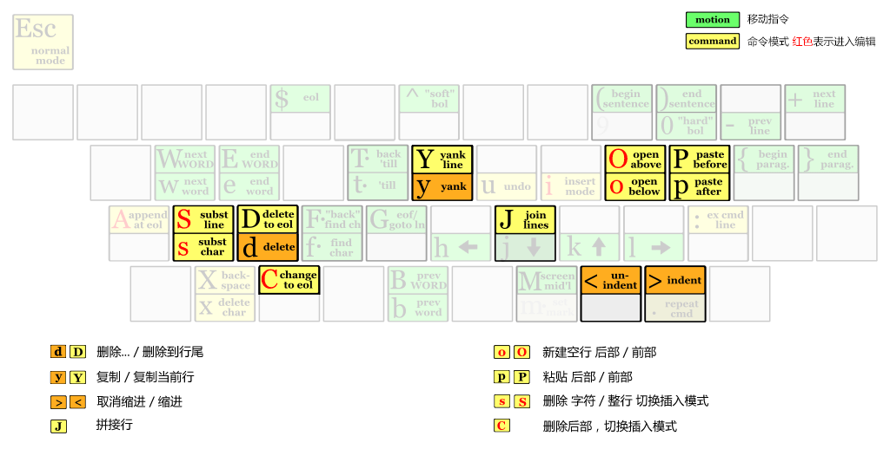
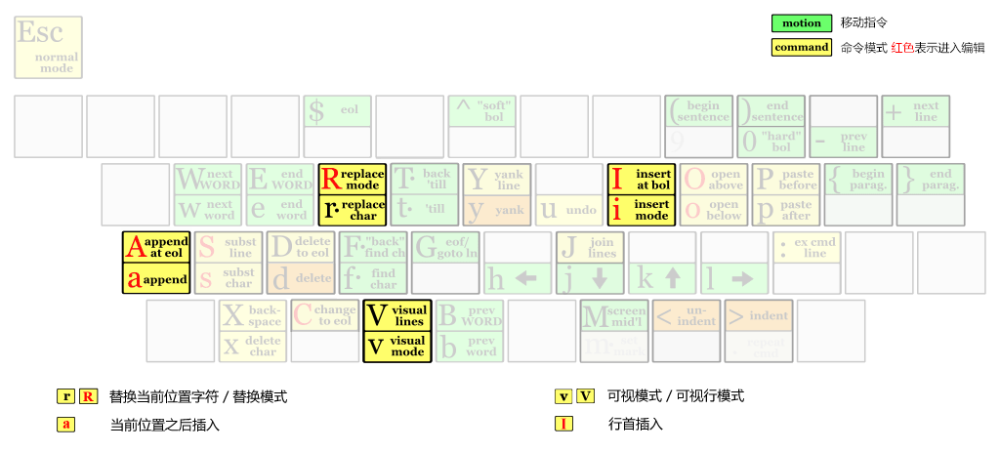

title: 03. VI编辑器 ADV
speaker: LI YANG
transition: slide3
files: /js/demo.js,/css/demo.css
theme: light
usemathjax: yes


[slide]
# VIM


[slide]
# 2.6 高级编辑
- `d...`： 删除...
- `dd`： 删除一行
- `D`： 删除到行尾
- `y`： 复制
- `yy` / `Y`： 复制当前行
- `j`： 拼接行
- `p` / `P`： 粘贴 `后部` / `前部`
- `o` / `O`： 新建空行 `后部` / `前部`
- `s` / `S`： 删除 `字符` / `整行` 切换插入模式
- `C`： 删除后部，切换插入模式
- `<` / `>`： `取消缩进` / `缩进`

[slide]


[slide]
# 2.7 复杂模式
- `i` / `I`： 当前位置插入 / 行首插入
- `a` / `A`： 当前位置之后插入 / 行尾插入
- `r` / `R`： 替换当前位置字符 / 替换模式
- `v` / `V`： 可视模式 / 可视行模式

[slide]



[slide]
# 2.8 查询
- `/` / `?`： 向 `下` / `上` 查找
- `n` / `N`： 继续向 `下` / `上` 查找
- `*` / `#`： 向 `下` / `上` 查找光标处单词（要完全符合）


[slide]
# 2.9 替换 
`:[range]s/pattern/string/[c,e,g,i]`

- range： 指的是範圍，`1,7` 指從第一行至第七行，`1,$` 指從第一行至最後一行，也就是整篇文章，也可以 % 代表。
- pattern： 就是要被替換掉的字串，可以用 regexp 來表示。
- string： 將 pattern 由 string 所取代。
- c： confirm，每次替換前會詢問。
- e： 不顯示 error。
- g：  globe，不詢問，整行替換。
- i： ignore 不分大小寫。

> g 一般都要加，否則只替換每一行的第一個符合的字符串


[slide]
# 2.10 书签
- `mx`： `x` 代表 26 个小写英文字母，当前光标处就会被记录
- `x`： 跳到书签位置位置

[slide]
# 课堂练习
1 . 使用 vim 打开文本 file.txt 
2 . 根据文章中的要求进行练习

完成第2步的任务后，继续完成任务 3-5
3 . 将文章中所有的逗号后面加一个空格, 即把 `short,we` 变成 `short, we`；
4 . 查到文章中所有的 单词 `We`的个数，分别统计`不区别大小写`和`区别大小写`的情况；
5 . 在文章的第一段和最后一段分别设置书签，练习使用书签进行跳转；


file.txt 文本内容如下：

```html
Learning to say NO 

We've all been taught that we should help people.It is the right thing to do and will [去掉will] make us popular with others.

It may even win us favors in return.

However,we must be realistic.We can't say yes to every request.
If we did,we would fail or go crazy for sure.

Sometimes we simply don't have the [去掉the] time to help.In this case,we must know how to say no politely.

Saying NO can be very difficult.

People with low self-esteem very often have a lack of assertiveness and think they have to meet the expectations of everyone.

It is very hard [very difficult 是一个固定搭配] for them to set limits with others.

They sometimes feel ashamed or [加上一个even 会更好] guilty if they would say NO.

But to do things against your will and possibilities will end up in feeling used and resentful. [整句替换为：However it is also difficult to against your will. ]

A simple and direct "NO,I am not able to help you with that" is the best solution.

If you want to [改成have to] give an explanation you should keep it simple:” NO,I have already made an another appointment for this time" or "NO,sorry. I am afraid I have to decline because I have no spare time." 

If someone makes a request it is fair to ask for time to think it over. [将该句话全部删除]

The decision should be up to you,but sometimes it is difficult to say NO right now. [将该句移动到文章最后]

You can try to use an empathic NO,if you would have helped under different circumstances: 

For example,if someone ask you to take care of his cat you may refuse like this

"Sorry,no. I would have kept your cat next weekend.But I will be off for visit.

I know it will be hard to find somebody to take care off the cat. [将somebody改成someone]

I will try to help you next time." 

We 
must 
not 
feel 
guilty 
about 
saying 
no.  [将上面的8个单词合并成一行句子]

Sometimes refusing others is the right thing to do.It can save ourselves,and them,a lot of trouble.

In short,we cannot please everyone all the time.

Refusing favors is a part of life. [将这句话复制到文章的标题之后，作为第一段]
```