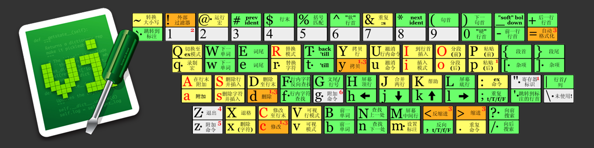
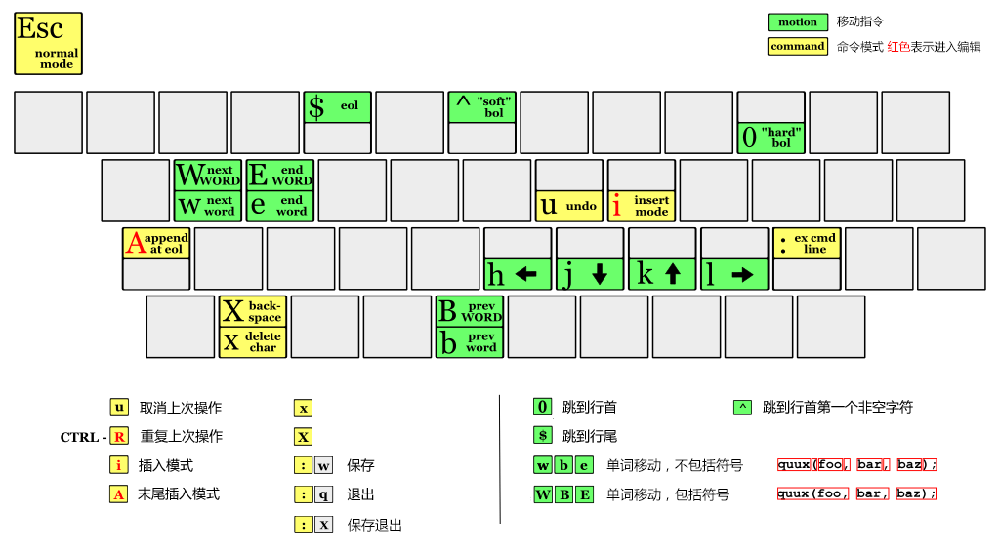
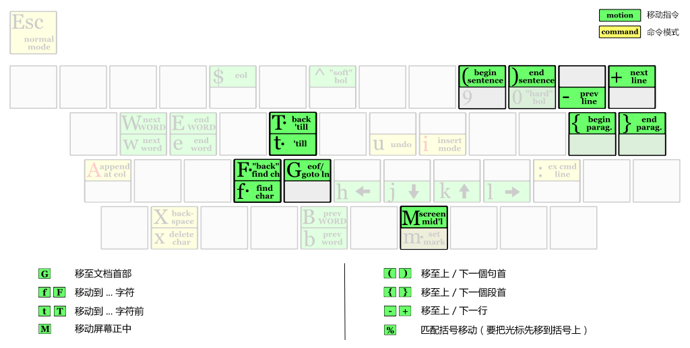

title: 03. VI编辑器
speaker: LI YANG
transition: slide3
files: /js/demo.js,/css/demo.css
theme: light
usemathjax: yes


[slide]
# VIM

[slide]
# 1. 背景介绍 


[slide]
# 什么是VIM
以下两句对编辑器的最高评价足矣：

- VIM is the God of editors, EMACS is God’s editor
- EMACS is actually an OS which pretends to be an editor




[slide]
# 1.1 为什么选VIM
我们所处的时代是非常幸运的，有越来越多的编辑器，相对于古老的VIM和EMACS，它们被称为现代编辑器。我们来看看这两个古董有多大年纪了：

> 
**EMACS** : 1975 ~ 2013 = 38岁  
**VI**    : 1976 ~ 2013 = 37岁  
**VIM**   : 1991 ~ 2013 = 22岁  

看到这篇文章的人有几个是比它们大的

[slide]
VIM的学习曲线非常陡，这里有一个主流编辑器的学习曲线对比。既然学习VIM如此之难，而现代编辑器又已经拥有了如此多的特性，我们为什么要花大量的时间来学习这个老古董呢？

[slide]
# 1.2 为什么选其它
先来看看为什么我们会选现在所使用的编辑器？这里我简单列举一些用户期望的功能：

- 轻量级，迅速启动
- 语法高亮
- 自动对齐
- 段落折叠
- 自动补全
- 显示行号
- 重定义Tab
- 列编辑模式
- 高级搜索，替代
- 错误恢复
- 迅速跳转
- 美观漂亮

[slide]
# 1.3 为什么犹豫选择它们
总有一些理由让我们一再犹豫的选择某些编辑器：

- 太贵：虽然知道VS很贵，但看到价格时，还是被吓了一跳
Visual Studio Profession 2012 : 11645元
UtralEdit : 420元
Source Insight : 2500元
- 不能跨平台：VS, SI, UE，Notepad++这些只能在Windows上，TextMate只能运行于Mac上;
- 不容易扩展

[slide]
# 1.4 VIM 的强大
- VIM包含了上面列的所有现代编辑器的优点，并且远远多于此。
- VIM 拥有无止尽的扩展：现在VIM的官方网站上已经有了5532个扩展，并且在不断增加…
- 完美的跨平台：VIM具有各种平台的应用，比如Windows的 `gVim`， Linux内置默认，Mac的 `MacVim`
- 开源
- 用起来很酷

[slide]
# 1.5 如何学习 VIM
- 初级阶段：简介基本入门知识，通过游戏 `VIM大冒险` 提高操作熟练度；
- 中级阶段：介绍自动处理技巧，通过大量实际任务理解原理；

```
https://vim-adventures.com/
```

[slide]
# 2. 基本阶段

[slide]
# 2.1 安装VIM
```bash
$ sudo apt-get install vim
```

[slide]
# 2.2 打开/保存/退出文件
- 打开VIM时新建文件： `vim filename`
- 进入VIM后再新建文件： 使用冒号命令 `:e filename` ，如果该 不存在的話，就会新建一个文件。

[slide]
# 2.3 执行模式
VIM 的模式可有六种，初级阶段暂时介绍三种：

1. Normal mode(common mode，以下簡稱 c-mode)：
刚进入 VIM 就是处于 `c-mode`，只能输入指令（比如移动光标、切换编辑模式、查找替换），不能輸入文字。
2. Insert mode(i-mode)：
按 `i` 就會進入 `i-mode` ，此時可以输入文字，编辑文章，按 `Esc` 又會回到 `c-mode`。
3. Ed mode(common-line mode，e-mode)：
按冒號 `：` 就會進入 `e-mode` ，左下角會有一個冒號 `：` 出現；也是按 `Esc` 回 `c-mode`。

[slide]
# 2.4 基本操作
- `h` : 左移
- `l` : 右移
- `j` : 下移
- `k` : 上移
- `x` : 删除当前光标所在位置的字符
- `X` : 回退一个字符
- `u` : 取消上次操作
- `0` : 跳到行首
- `^` : 跳到第一个非空格字符
- `$` : 跳到行尾

[slide]


[slide]
# 2.5 高级移动
- `gg`: 跳到文档开头
- `G`: 跳到文档结束
- `f` / `F`... :  `后跳` / `前跳`
- `t` / `T`... : `后跳` / `前跳` (字符右边)


> 小窍门： 数字加上 跳转命令可以跳转到第 `n` 个字符，比如 `3fa` 表示跳转到 第3个出现的 `a` 处; `3G` 表示跳转到 第3行；


[slide]


[slide]
# 练习一


1. 在 `home` 目录新建一个 `Text` 文件夹；
2. 进去 `Text` 文件夹，使用 `touch` 命令新建一个 `exercise.md` 文件；
3. 使用 vim 打开 `exercise01.md` 文件，编辑输入下面的内容；
```html
Is it a reflection of an increasingly acrimonious political environment, a sign that liberals are spinning out of control or a reasonable response by citizens faced with what some see as a historic national crisis and a president who critics say likes to stoke the fires of discord? It depends on who you ask and - in an increasing fractured US society - their partisan proclivities.

The recent round of actions and reactions, accusations and recriminations, began last week when a group protesting against the administration's policy of separating undocumented migrant families at the border forced Homeland Security Secretary Kirstjen Nielsen to cut short a dinner in a Washington Mexican restaurant.

There have been protests since the start of the Trump presidency, of course, but the audio recordings and first-person accounts of crying children and despondent parents have sent a shock of crackling anger through already frayed nerves of those on the left.
```
4. 找到文中所有的 `and` ，并且将其修改成 `And` 
5. 将光标移动到文章开头，然后将光标移动到第二段的 `forced` 单词位置，在后面添加新的一行。
6. 跳到文章的的最后一行，找到 `nerves` 单词，并且将最后的字母 `s` 删除；


# 练习二
1. 在 退出vim编辑器；
2. 用 vim 命令新建文本 `exercise02.md`，编辑输入下面的内容；
```html
<body>
    <div class="container-fluid">
      <div class="portlet">
        <div class="portlet-title ">
        </div>
        <div class="portlet-body">
          <div class="table-data" name="tom" value="100"></div>
          <div class="table-pg"  name="green" value="20"></div>
        </div>
      </div>
    </div>
    <script src="/lib/metronic/ui-modals.min.js"></script>
    <script src="/lib/pace/pace.min.js"></script>
    <script src="/sys/js/common.js"></script>
    <script src="/sys/js/admin/auditShop.js"></script>
</body>
```
3. 找到 `value="100"` 并且将 `100` 改为 `365`
4. 将光标停留在 `table-pg` 单词的 `t` 上，要求输入 `2个` 字符将光标跳到 `value="20"` 的 `2` 上；
5. 再次将光标移动到 - 符号处，并且将其删除，使 `table-pg` 变成 `tablepg`
6. 将光标移动到文章开头部分，然后将文章中所有的 div 换成 span ，并且计算每次替换需要输入几个字符；
